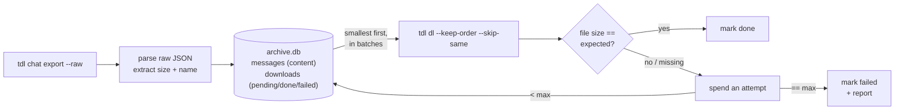

<div align="center">

# tgxiv

### Archive a Telegram channel. Smallest media first, size-verified, resumable.

Drives the tdl Telegram engine as a subprocess and ships a web viewer — no
services to run.

[](LICENSE)
[](https://go.dev)
[](https://github.com/myl7/tdl)
[](https://sqlite.org)

Point it at a channel. It exports the message manifest, then pulls every photo
and file in strict **smallest-to-largest** order, checks each one against its
expected byte size, retries what fails, and resumes exactly where it stopped.
Run `sync` later and it fetches only what is new.

</div>

---

## Why

Downloading a whole channel sounds simple until you actually do it. Files arrive
out of order, a dropped connection leaves half-written garbage, a rerun starts
from scratch, and you never quite know whether every file made it. `tgxiv` turns
that into a boring, repeatable operation.

The Telegram engine is [tdl](https://github.com/iyear/tdl) — run as an external
binary, built from the [myl7 fork](https://github.com/myl7/tdl) with three
patches: keep-order download, per-op kv open, and log-lines progress. tgxiv
contains no tdl code; the two talk only via CLI flags and JSON files. Three
consequences of that engine shaped the design:

- Stock tdl re-sorts messages by id, so it cannot download by size on its own.
  The fork's keep-order patch lets `tgxiv` drive the order instead.
- A media file's true byte size lives only in the raw export, so `tgxiv` reads it
  straight from there, using the exact rule tdl uses. Ordering and verification
  agree with what actually gets downloaded.
- tdl names files `<channelID>_<messageID>_<name>`, so any finished download can
  be located by prefix and checked by size, whatever its extension turned out.

## Features

- 📈 **Smallest first, always.** Every pending file is sorted by size and
  downloaded strictly smallest to largest, across the whole channel.
- 🔎 **Every file verified.** Each download is checked against its expected byte
  size. A mismatch is not "done", it is a retry.
- 🔁 **Bounded retries.** A file that keeps failing is retried up to N times, then
  marked `failed` and written to a report. It never loops forever.
- ⏸️ **Stop anytime, resume clean.** Ctrl-C interrupts tdl (SIGINT) for a
  graceful stop. The next run skips finished files and never leaves a truncated
  file marked done.
- ⏩ **Incremental sync.** `sync` fetches only messages newer than your last
  run, tracked by a watermark in the state DB.
- 🧾 **The text stays too.** Every message's content — text-only and service
  messages included — is stored in `archive.db`, which is the channel's text
  archive.
- 🪶 **One Apache-2.0 binary, no services.** tgxiv contains no tdl code (the
  AGPL-3.0 engine is a separate program), state is pure-Go SQLite, no cgo.
  Your files land in a plain directory.

## How it works



1. **export** runs `tdl chat export` (`--all --with-content --raw`). The export
   JSON is transient transport: it is deleted as soon as it has been imported.
2. **import** streams that JSON into `archive.db`. Every message gets a content
   row in `messages` (text, type, date, raw); the media subset is additionally
   upserted into `downloads` as `pending` (id, size, name).
3. **download** takes all `pending` rows ordered by size, splits them into
   batches, and runs `tdl dl` with `--keep-order --skip-same --continue` on
   each. After every batch it verifies each file by size, marking it `done` or
   spending one retry attempt. Files land in `media/` named
   `<channelID>_<msgID>_<name>`. A batch that writes no bytes for
   `--idle-timeout` (default `5m`, `TGXIV_IDLE_TIMEOUT`, `0s` disables) is
   killed, and repeated stalls count toward the failed threshold.
4. **report** lists anything that exhausted its attempts under `logs/`.

## Requirements

- **Go 1.26+** to build.
- A **tdl binary** built from the [myl7 fork](https://github.com/myl7/tdl) (the
  AGPL-3.0 engine). An explicit `--tdl`/`TGXIV_TDL` wins; otherwise tgxiv looks
  on `PATH`, then for `tdl`/`tdl.exe` in the working directory. Sanity-check the
  fork build with `tdl dl --help | grep keep-order`.
- A **Telegram account** that can read the channel.

## Install

```sh
# build the engine first (AGPL-3.0, kept out of tgxiv)
git clone https://github.com/myl7/tdl && cd tdl
go build -o /usr/local/bin/tdl .

# then tgxiv itself
git clone https://github.com/myl7/tgxiv && cd tgxiv && make build
# binary at bin/tgxiv (plain "go build ." works too)

# log in once (QR code; default namespace) — or just "tdl login"
tgxiv login
```

## Build

`make build` produces `bin/tgxiv` with the web viewer embedded: the `web`
target builds the viewer and packs it into `internal/webui/dist` as
pre-gzipped files, then the binary is built stripped (`-trimpath` +
`-ldflags "-s -w"`). Rebuilding the viewer needs Node and pnpm; a plain
`go build .` works without them and embeds the placeholder page instead — run
`make web` (`pnpm --dir web build` + `node web/scripts/pack-dist.mjs`) first
to get the real viewer into the binary.

## Quickstart

```sh
# first archive: full export, then download smallest-first
tgxiv -d ~/archives/mychannel -c mychannel archive

# later: pull only what is new
tgxiv -d ~/archives/mychannel sync

# check progress and any failures
tgxiv -d ~/archives/mychannel status
```

Configuration comes from flags or environment variables:

| flag         | env          | meaning                                    |
|--------------|--------------|--------------------------------------------|
| `--dir, -d`  | `TGXIV_DIR`  | archive directory (required)               |
| `--chat, -c` | `TGXIV_CHAT` | channel username, id, or link (for export) |
| `--ns, -n`   | `TGXIV_NS`   | tdl session namespace (default `default`)  |
| `--tdl`      | `TGXIV_TDL`  | tdl executable (default `tdl`)             |

Legacy `TGCA_*` env vars are still honored as fallback.

> The `--ns` must match the namespace you logged in with. A plain
> `tgxiv login` uses `default`, which is also tgxiv's default.

## Commands

| command        | what it does                                                          |
|----------------|-----------------------------------------------------------------------|
| `login`        | log in to Telegram via `tdl login` (QR by default; `--code` for phone+code) |
| `archive`      | full export + download (use for the first run and periodic reconcile) |
| `sync`         | incremental: export + download only messages newer than last time     |
| `manifest`     | full export + import manifest, no download                            |
| `download`     | download all pending media, verify, retry                             |
| `migrate [FILE...]` | legacy: backfill content from JSON-era snapshots in export/, or import given tdl export JSON files; offline, no tdl call |
| `status`       | counts (total / done / pending / failed) and the failed list          |
| `reset-failed` | flip every `failed` message back to `pending` for another try         |
| `serve`        | serve the bundled web viewer for a channels directory (`--channels`, `--addr`) |

Download tunables (on `archive`, `sync`, `download`):

```sh
tgxiv -d DIR download \
  --batch 100 \   # messages per download invocation; 1 = one message per call
  --attempts 3 \  # size-verify retries per message before "failed"
  --threads 4 \   # passed to tdl (--threads)
  --limit 2       # passed to tdl (--limit, concurrent files)
```

## Incremental sync

`sync` fetches only messages newer than the last run instead of re-scanning the
whole channel:

1. Every import records a **watermark**: the highest message id seen, counting
   non-media messages too. A run of trailing text-only posts still advances it,
   so it is not re-scanned next time.
2. `sync` runs an incremental export (`id >= watermark+1`), imports the new
   media as `pending`, and downloads it, still smallest-first and verified.
3. On a brand-new archive with no watermark yet, `sync` falls back to a full
   export.

Incremental moves forward only. Edits or deletions of older messages keep their
id and sit below the watermark, so `sync` will not notice them. Run a full
`archive` now and then to reconcile. Backfilling messages older than your first
archived id is out of scope.

## Interruption and resume

Press Ctrl-C at any time. It interrupts tdl (SIGINT), which stops cleanly.
On the next run:

- `archive.db` still knows which messages are `done`, so they are not re-listed.
- tdl's `--skip-same` skips any file already present at the right size,
  and `--continue` semantics are preserved as before.
- A file that was mid-transfer is re-downloaded from scratch (partial bytes are
  not resumed), so there is never a truncated file marked done.

## Directory layout

```
<dir>/
  archive.db          # SQLite: messages content + downloads state (+ meta)
  archive.db.v1.bak   # one-time backup copy from the v1 -> v2 upgrade, if any
  media/              # downloaded files, named <channelID>_<msgID>_<name>
  logs/               # failed-<timestamp>.txt reports
  export/             # JSON-era archives only: old export snapshots (see migrate)
```

`export/` only exists in archives made before the DB stored content. `tgxiv
migrate` replays those snapshots into `archive.db`'s content table (offline, no
tdl call, files untouched), or imports a tdl export JSON you pass it; after
that the directory is optional to delete.

## Web viewer

`web/` is a Next.js app (formerly the standalone tdl-viewer) that reads each
channel directory's `archive.db` directly, read-only, and serves `media/` files
alongside. No re-merging, no rebuild on new messages.

```sh
cd web && pnpm install && pnpm build && pnpm start
```

Set `CHANNELS_DIR` to the parent of your archive dirs (default `./channels`).
Channel dirs are named `<name>` or `<name>_@<id>`; a directory counts as a
channel when it contains an `archive.db`.

## Notes and limits

- Run one `tgxiv` per archive directory at a time: two runs on one dir would
  race the state DB and the batch file.
- Photo sizes are taken from the largest reported size, matching tdl. Documents
  verify exactly. If a provider reports a size that differs from the delivered
  bytes, that message exhausts its attempts and lands in `failed`.

## License

[Apache License 2.0](LICENSE). Copyright 2026 Yulong Ming.

tgxiv contains no tdl code. The engine — [tdl](https://github.com/iyear/tdl)
by iyear, as forked at [myl7/tdl](https://github.com/myl7/tdl) — is a separate
AGPL-3.0 program invoked as a subprocess, communicating with tgxiv only via
CLI flags and JSON files. tgxiv binaries therefore remain Apache-2.0.
