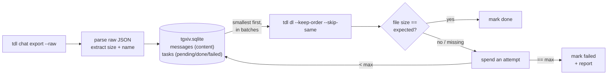

<div align="center">

# tgxiv

### Archive Telegram dialogs. Smallest media first, size-verified, resumable.

Drives the tdl Telegram engine as a subprocess and ships a web viewer — no
services to run.

[](LICENSE)
[](https://go.dev)
[](https://github.com/myl7/tdl)
[](https://sqlite.org)

Point it at a chat. It exports the message manifest, then pulls every photo
and file in strict **smallest-to-largest** order, checks each one against its
expected byte size, retries what fails, and resumes exactly where it stopped.
One archive root holds any number of dialogs — channels, groups, and private
chats alike — each syncing and resuming on its own. Run `sync` later and it
fetches only what is new.

</div>

---

## Why

Downloading a whole channel sounds simple until you actually do it. Files arrive
out of order, a dropped connection leaves half-written garbage, a rerun starts
from scratch, and you never quite know whether every file made it. `tgxiv` turns
that into a boring, repeatable operation.

The Telegram engine is [tdl](https://github.com/iyear/tdl) — run as an external
binary, built from the [myl7 fork](https://github.com/myl7/tdl) with three
patches: keep-order download, per-op kv open, and log-lines progress. tgxiv
contains no tdl code; the two talk only via CLI flags and JSON files. Three
consequences of that engine shaped the design:

- Stock tdl re-sorts messages by id, so it cannot download by size on its own.
  The fork's keep-order patch lets `tgxiv` drive the order instead.
- A media file's true byte size lives only in the raw export, so `tgxiv` reads it
  straight from there, using the exact rule tdl uses. Ordering and verification
  agree with what actually gets downloaded.
- tgxiv drives tdl's naming with a `--template`, so downloads land in
  `media/<dialog_id>/` as `<msgID>_<name>` and any finished download can be
  located by its msg-id prefix and checked by size, whatever its extension
  turned out.

## Features

- 🗃️ **One root, many dialogs.** A single `tgxiv.sqlite` manages any number of
  dialogs — channels, groups, and private chats alike. Each dialog syncs,
  downloads, and resumes independently of the others.
- 📈 **Smallest first, always.** Every pending file is sorted by size and
  downloaded strictly smallest to largest, across the whole dialog.
- 🔎 **Every file verified.** Each download is checked against its expected byte
  size. A mismatch is not "done", it is a retry.
- 🔁 **Bounded retries.** A file that keeps failing is retried up to N times, then
  marked `failed` and written to a report. It never loops forever.
- ⏸️ **Stop anytime, resume clean.** Ctrl-C interrupts tdl (SIGINT) for a
  graceful stop. The next run skips finished files and never leaves a truncated
  file marked done.
- ⏩ **Incremental sync.** `sync` fetches only messages newer than your last
  run, tracked by a per-dialog watermark in the state DB.
- 🧾 **The text stays too.** Every message's content — text-only and service
  messages included — is stored in `tgxiv.sqlite`, which is each dialog's text
  archive.
- 🪶 **One Apache-2.0 binary, no services.** tgxiv contains no tdl code (the
  AGPL-3.0 engine is a separate program), state is pure-Go SQLite, no cgo.
  Your files land in a plain directory.

## How it works



1. **export** runs `tdl chat export` (`--all --with-content --raw`) for the one
   dialog picked by the shared `--chat, -c` flag — a username, a bare dialog
   id, or a t.me link (Bot-API marked forms like `-100…` are normalized to the
   bare id). The export JSON is transient transport: it is deleted as soon as
   it has been imported.
2. **import** streams that JSON into `tgxiv.sqlite`. The dialog gets (or
   updates) its row in `dialogs` — title, username (stored without the `@`),
   and kind are filled automatically from `tdl chat ls -o json`. Every message
   gets a content row in `messages` (text, type, date, raw); the media subset
   is additionally upserted into `tasks` as `pending` (file name, size, media
   type). Each import also advances the dialog's `last_msg_id` watermark.
3. **download** takes the dialog's `pending` tasks ordered by size, splits them
   into batches, and runs `tdl dl` with `--keep-order --skip-same --continue`
   on each, into `media/<dialog_id>/` via
   `--template "{{ .MessageID }}_{{ filenamify .FileName }}"`. Files land as
   `<msgID>_<file_name>` — the dialog id lives in the folder, not the
   filename. After every batch it verifies each file by size, marking it
   `done` or spending one retry attempt. A batch that writes no bytes for
   `--idle-timeout` (default `5m`, `TGXIV_IDLE_TIMEOUT`, `0s` disables) is
   killed, and repeated stalls count toward the failed threshold.
4. **report** writes a failed report per run per dialog to
   `logs/failed-<dialog_id>-<timestamp>.txt`.

## Requirements

- **Go 1.26+** to build.
- A **tdl binary** built from the [myl7 fork](https://github.com/myl7/tdl) (the
  AGPL-3.0 engine). An explicit `--tdl`/`TGXIV_TDL` wins; otherwise tgxiv looks
  on `PATH`, then for `tdl`/`tdl.exe` in the working directory. Sanity-check the
  fork build with `tdl dl --help | grep keep-order`.
- A **Telegram account** that can read the dialogs you archive.

## Install

```sh
# build the engine first (AGPL-3.0, kept out of tgxiv)
git clone https://github.com/myl7/tdl && cd tdl
go build -o /usr/local/bin/tdl .

# then tgxiv itself
git clone https://github.com/myl7/tgxiv && cd tgxiv && make build
# binary at bin/tgxiv (plain "go build ." works too)

# log in once (QR code; default namespace) — or just "tdl login"
tgxiv login
```

## Build

`make build` produces `bin/tgxiv` with the web viewer embedded: the `web`
target builds the viewer and packs it into `internal/webui/dist` as
pre-gzipped files, then the binary is built stripped (`-trimpath` +
`-ldflags "-s -w"`). Rebuilding the viewer needs Node and pnpm; a plain
`go build .` works without them and embeds the placeholder page instead — run
`make web` (`pnpm --dir web build` + `node web/scripts/pack-dist.mjs`) first
to get the real viewer into the binary.

## Quickstart

```sh
# first dialog: full export, then download smallest-first
tgxiv -d ~/archives/root -c mychannel archive

# a second dialog into the SAME root: same database, same media tree
tgxiv -d ~/archives/root -c othergroup archive

# check progress and any failures: global summary plus a per-dialog block
tgxiv -d ~/archives/root status

# targeted retry of specific downloads, whatever their prior status
tgxiv -d ~/archives/root download --retry 1234567890/1101,1234567890/1102
```

Configuration comes from flags or environment variables:

| flag         | env          | meaning                                           |
|--------------|--------------|---------------------------------------------------|
| `--dir, -d`  | `TGXIV_DIR`  | archive root directory — one root, many dialogs   |
| `--chat, -c` | `TGXIV_CHAT` | dialog to act on: username, bare id, or t.me link |
| `--ns, -n`   | `TGXIV_NS`   | tdl session namespace (default `default`)         |
| `--tdl`      | `TGXIV_TDL`  | tdl executable (default `tdl`)                    |
| `--addr`     | `TGXIV_ADDR` | `serve` listen address (default 127.0.0.1:8080)   |

Legacy `TGCA_*` env vars are still honored as fallback.

> The `--ns` must match the namespace you logged in with. A plain
> `tgxiv login` uses `default`, which is also tgxiv's default.

## Commands

| command              | what it does                                                                  |
|----------------------|-------------------------------------------------------------------------------|
| `login`              | log in to Telegram via `tdl login` (QR by default; `--code` for phone+code)   |
| `archive`            | full export + download for the `--chat` dialog (first run, periodic reconcile) |
| `sync`               | incremental: export + download only messages newer than last time, per dialog |
| `manifest`           | full export + import for the `--chat` dialog, no download                     |
| `download` (`dl`)    | download the dialog's pending media, verify, retry                            |
| `status`             | global summary plus a per-dialog block; `--chat` narrows to one dialog        |
| `reset-failed`       | flip every `failed` task back to `pending` (all dialogs by default; `--chat` scopes to one) |
| `split`              | move dialogs (rows, media, watermarks) out of this archive root into another via `--to` |
| `serve`              | serve the bundled web viewer from an archive root via the shared `--dir` (see Web viewer) |

`archive`, `sync`, `manifest`, and `download` each operate on ONE dialog,
selected by the shared `--chat, -c` flag: a username, a bare dialog id, or a
t.me link (Bot-API marked forms like `-100…` are normalized to the bare id
automatically). `--dir, -d` (env `TGXIV_DIR`) points every command at the
same multi-dialog archive root.

`download --retry <dialog_id>/<msg_id>` re-runs specific tasks whatever their
prior status: it resets those tasks to `pending` and downloads exactly those.
The flag is repeatable; ids may also be comma-separated.

Download tunables (on `archive`, `sync`, `download`):

```sh
tgxiv -d DIR download \
  --batch 100 \   # messages per download invocation; 1 = one message per call
  --attempts 3 \  # size-verify retries per message before "failed"
  --threads 4 \   # passed to tdl (--threads)
  --limit 2       # passed to tdl (--limit, concurrent files)
```

## Incremental sync

`sync` fetches only messages newer than the last run instead of re-scanning the
whole dialog:

1. Every import advances the dialog's **watermark** (`last_msg_id`): the
   highest message id seen, counting non-media messages too. A run of trailing
   text-only posts still advances it, so it is not re-scanned next time.
2. `sync` runs an incremental export (`id >= watermark+1`), imports the new
   media as `pending`, and downloads it, still smallest-first and verified.
3. On a brand-new dialog with no watermark yet, `sync` falls back to a full
   export.

Watermarks are per dialog: syncing one dialog never moves another's, so each
chat in the root syncs on its own schedule.

Incremental moves forward only. Edits or deletions of older messages keep their
id and sit below the watermark, so `sync` will not notice them. Run a full
`archive` now and then to reconcile. Backfilling messages older than your first
archived id is out of scope.

## Interruption and resume

Press Ctrl-C at any time. It interrupts tdl (SIGINT), which stops cleanly.
On the next run:

- The dialog's `tasks` in `tgxiv.sqlite` still know which downloads are `done`,
  so they are not re-listed. Task state is scoped per dialog — interrupting one
  dialog never touches another's progress.
- tdl's `--skip-same` skips any file already present at the right size,
  and `--continue` semantics are preserved as before.
- A file that was mid-transfer is re-downloaded from scratch (partial bytes are
  not resumed), so there is never a truncated file marked done.

## On-disk format (v1.0.0)

The layout below is the frozen contract of the 1.0.0 release: tools may build
against it, and tgxiv will not change it within the 1.x line without a
documented, additive transition.

```
<root>/
  tgxiv.sqlite            # SQLite: dialogs + messages content + tasks state
  media/<dialog_id>/      # downloaded files, named <msgID>_<file_name>
  export/<dialog_id>/     # transient batch.json + export JSON during runs
  logs/                   # failed-<dialog_id>-<timestamp>.txt reports
```

Conventions the contract pins: dialog ids are bare positive Telegram ids;
usernames are stored without the `@`; `tasks.path` is always root-relative
with `/` separators; `dialogs.last_msg_id` is each dialog's private
incremental-sync watermark. Every `media/<dialog_id>/` also holds a small
`dialog.txt` key-value pointer file tgxiv maintains — `dialog_id` always,
`title`/`username` lines when known (username in its stored no-`@` form) — so
a person browsing the tree can tell which channel a numeric folder belongs to;
the name `dialog.txt` is reserved and can never collide with a download
(files are always `<msgID>_-prefixed`).

File names are sanitized locally before the download: path separators, control
bytes, and Windows-forbidden characters are replaced with `_`, trailing dots
and spaces are trimmed, and a media name that is empty or has nothing usable
left becomes a UUID. `tasks` records the resulting on-disk name in
`file_name_disk` whenever it differs from the media-provided one — sane names
are stored and written verbatim. There is deliberately no length truncation:
on Windows the effective path limit for tgxiv is 260 UTF-16 characters (Go
binaries embed no long-path-aware manifest), so a root prefix that is too deep
surfaces as ordinary download failures whose error text names the path
length — an honest failure beats a silently renamed file.

Every completed download is also content-hashed: the task row stores the
SHA-256 of the file's bytes (lowercase hex) in `file_hash` — the basis for a
future content-dedup feature, since forwarded media is common in channels.
Rows that predate 1.0.0 keep an empty hash until their file is re-downloaded.

The database runs in WAL mode: `tgxiv.sqlite-wal` and `tgxiv.sqlite-shm` sit
next to it while any tgxiv process has the root open. When cold-copying a
root, stop tgxiv first (or copy all three files together), or the most recent
writes may be left behind in the WAL.

One root hosts any number of dialogs — channels, groups, and private chats
alike — one row each in `dialogs`, one subdirectory each under `media/`. The
`--dir, -d` flag (env `TGXIV_DIR`) points at this root for every command.

## Splitting an archive root

`tgxiv -d ROOT split --to OTHER_ROOT <dialog_id>...` moves whole dialogs out
of one archive root into another — rows, media, and sync watermarks together —
when one root should serve a different purpose (public vs. private, hot vs.
cold). The destination root is created if absent. Id lists are quote-free:
each argument may itself be comma-separated, so `111 222` and `"111,222"` are
the same command. Media folders move first, then a single cross-database
transaction copies the rows into the destination and deletes them from the
source — which makes an interrupted run resumable by re-running the same
command: already-moved dialogs are recognized and skipped.

## Web viewer

`tgxiv serve` serves the bundled viewer from an archive root, via the same
shared `--dir`/`TGXIV_DIR` flag as every other command (default `channels`);
`--addr`/`TGXIV_ADDR` (default `127.0.0.1:8080`) sets the listen address. The
viewer (`web/`, a Next.js app — formerly the standalone tdl-viewer, embedded
into the binary at build time) reads `tgxiv.sqlite` directly, read-only, and
streams `media/` files alongside. No re-merging, no rebuild on new messages.

Dialogs are enumerated from the `dialogs` table — no directory scanning. URLs
use the numeric dialog id (`/api/channels/{id}/messages`,
`/downloads/{id}/{msgId}`), and a dialog's display name falls back title →
@username → #id. Media streams from `media/<dialog_id>/` with Range support.

## Notes and limits

- Run one `tgxiv` per archive root at a time: two runs on one root would race
  the state DB and the batch file.
- Photo sizes are taken from the largest reported size, matching tdl. Documents
  verify exactly. If a provider reports a size that differs from the delivered
  bytes, that message exhausts its attempts and lands in `failed`.

## License

[Apache License 2.0](LICENSE). Copyright 2026 Yulong Ming.

tgxiv contains no tdl code. The engine — [tdl](https://github.com/iyear/tdl)
by iyear, as forked at [myl7/tdl](https://github.com/myl7/tdl) — is a separate
AGPL-3.0 program invoked as a subprocess, communicating with tgxiv only via
CLI flags and JSON files. tgxiv binaries therefore remain Apache-2.0.
