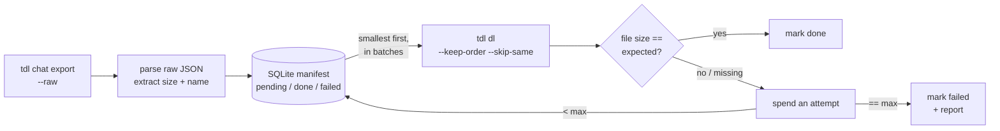

<div align="center">

# tgxiv

### Archive a Telegram channel. Smallest media first, size-verified, resumable.

[](LICENSE)
[](https://go.dev)
[](https://github.com/iyear/tdl)
[](https://sqlite.org)

Point it at a channel. It exports the message manifest with [tdl](https://github.com/iyear/tdl),
then pulls every photo and file in strict **smallest-to-largest** order, checks
each one against its expected byte size, retries what fails, and resumes exactly
where it stopped. Run `update` later and it fetches only what is new.

</div>

---

## Why

Downloading a whole channel sounds simple until you actually do it. Files arrive
out of order, a dropped connection leaves half-written garbage, a rerun starts
from scratch, and you never quite know whether every file made it. `tgxiv` turns
that into a boring, repeatable operation.

Three facts about tdl shaped the design:

- Stock `tdl dl` re-sorts messages by id, so it cannot download by size on its
  own. This project adds a `--keep-order` flag to the tdl engine and lets `tgxiv`
  drive the order instead.
- A media file's true byte size lives only in the raw export, so `tgxiv` reads it
  straight from there, using the exact rule tdl uses. Ordering and verification
  agree with what actually gets downloaded.
- tdl names files `<channelID>_<messageID>_<name>`, so any finished download can
  be located by prefix and checked by size, whatever its extension turned out.

## Features

- 📈 **Smallest first, always.** Every pending file is sorted by size and
  downloaded strictly smallest to largest, across the whole channel.
- 🔎 **Every file verified.** Each download is checked against its expected byte
  size. A mismatch is not "done", it is a retry.
- 🔁 **Bounded retries.** A file that keeps failing is retried up to N times, then
  marked `failed` and written to a report. It never loops forever.
- ⏸️ **Stop anytime, resume clean.** Ctrl-C is forwarded to tdl for a graceful
  stop. The next run skips finished files and never leaves a truncated file
  marked done.
- ⏩ **Incremental sync.** `update` fetches only messages newer than your last
  run, tracked by a watermark in the state DB.
- 🧾 **The text stays too.** Every export JSON (full and each delta) is kept as
  the channel's text archive.
- 🪶 **One binary, no services.** Pure-Go SQLite state, no database to run, no
  cgo. Your files land in a plain directory.

## How it works



1. **export** runs `tdl chat export -c CHAT --all --with-content --raw`.
2. **import** streams that JSON and records every media message (id, size, name)
   into `archive.db` as `pending`. Text-only messages are skipped; their content
   is already in the export file.
3. **download** takes all `pending` rows ordered by size, splits them into
   batches, and runs `tdl dl --keep-order --skip-same --continue` on each. After
   every batch it verifies each file by size, marking it `done` or spending one
   retry attempt.
4. **report** lists anything that exhausted its attempts under `logs/`.

## Requirements

- **Go 1.26+** to build.
- A **`tdl` binary built with the `--keep-order` patch**, logged in to an account
  that can read the channel. Check with `tdl dl --help | grep keep-order`.

## Install

```sh
# build the tdl engine (fork with --keep-order) and put it on PATH
git clone https://github.com/myl7/tdl && (cd tdl && go build -o ~/go/bin/tdl .)

# build tgxiv
git clone https://github.com/myl7/tgxiv && (cd tgxiv && go build -o ~/go/bin/tgxiv .)

# log in once (default namespace)
tdl login
```

## Quickstart

```sh
# first archive: full export, then download smallest-first
tgxiv -d ~/archives/mychannel -c mychannel sync

# later: pull only what is new
tgxiv -d ~/archives/mychannel -c mychannel update

# check progress and any failures
tgxiv -d ~/archives/mychannel status
```

Configuration comes from flags or environment variables:

| flag         | env          | meaning                                    |
|--------------|--------------|--------------------------------------------|
| `--dir, -d`  | `TGXIV_DIR`  | archive directory (required)               |
| `--chat, -c` | `TGXIV_CHAT` | channel username, id, or link (for export) |
| `--ns, -n`   | `TGXIV_NS`   | tdl session namespace (default `default`)  |
| `--tdl`      | `TGXIV_TDL`  | tdl executable (default `tdl`)             |

Legacy `TGCA_*` env vars are still honored as fallback.

> The `--ns` must match the namespace you logged in with. A plain `tdl login`
> uses `default`, which is also tgxiv's default.

## Commands

| command        | what it does                                                        |
|----------------|---------------------------------------------------------------------|
| `sync`         | full export + download (use for the first run and periodic reconcile) |
| `update`       | incremental: export + download only messages newer than last time   |
| `export`       | full export + import manifest, no download                          |
| `download`     | download all pending media, verify, retry                           |
| `import FILE`  | import an existing tdl export JSON (no tdl call)                    |
| `status`       | counts (total / done / pending / failed) and the failed list        |
| `reset-failed` | flip every `failed` message back to `pending` for another try       |

Download tunables (on `sync`, `update`, `download`):

```sh
tgxiv -d DIR download \
  --batch 100 \   # messages per tdl dl call; 1 = one message per call
  --attempts 3 \  # size-verify retries per message before "failed"
  --threads 4 \   # passed to tdl --threads
  --limit 2       # passed to tdl --limit (concurrent files)
```

## Incremental sync

`update` fetches only messages newer than the last run instead of re-scanning the
whole channel:

1. Every import records a **watermark**: the highest message id seen, counting
   non-media messages too. A run of trailing text-only posts still advances it,
   so it is not re-scanned next time.
2. `update` runs `tdl chat export --type id -i <watermark+1> ...`, imports the new
   media as `pending`, and downloads it, still smallest-first and verified.
3. On a brand-new archive with no watermark yet, `update` falls back to a full
   export.

Incremental moves forward only. Edits or deletions of older messages keep their
id and sit below the watermark, so `update` will not notice them. Run a full
`sync` now and then to reconcile. Backfilling messages older than your first
archived id is out of scope.

## Interruption and resume

Press Ctrl-C at any time. `tgxiv` forwards SIGINT to tdl so it can stop cleanly.
On the next run:

- The state DB still knows which messages are `done`, so they are not re-listed.
- tdl's `--skip-same` skips any file already present at the right size.
- A file that was mid-transfer is re-downloaded from scratch (tdl does not resume
  partial bytes), so there is never a truncated file marked done.

## Directory layout

```
<dir>/
  archive.db     # SQLite state: manifest + status + attempts + watermark
  media/         # downloaded files (tdl -d target)
  export/        # tdl export JSON snapshots (full + each delta = the text archive)
  logs/          # failed-<timestamp>.txt reports
```

## Notes and limits

- Run one `tgxiv` per archive directory at a time. Multiple tdl processes on the
  same namespace are safe (the session DB is opened per operation), but two
  `tgxiv` on one archive dir would race the state DB and the batch file.
- Photo sizes are taken from the largest reported size, matching tdl. Documents
  verify exactly. If a provider reports a size that differs from the delivered
  bytes, that message exhausts its attempts and lands in `failed`.

## License

[Apache License 2.0](LICENSE). Copyright 2026 Yulong Ming.

Built on [tdl](https://github.com/iyear/tdl) by iyear.
