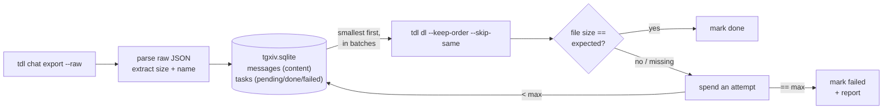

# tgxiv

**Archive Telegram channels/groups into SQLite and plain files — size-verified, resumable, smallest-first — and browse them with the built-in web viewer.**

[](LICENSE)
[](https://go.dev)
[](https://github.com/myl7/tdl)
[](https://sqlite.org)

tgxiv archives a Telegram dialog — a channel, a group, or a private chat —
into a single `tgxiv.sqlite` plus a plain directory of media files. The text
and metadata of every message are stored in the database; photos and documents
are downloaded in strict **smallest-to-largest** order, verified against the
byte size recorded at export time, retried on mismatch, and resumed exactly
where a previous run stopped. One archive root holds any number of dialogs,
each syncing and resuming independently. `tgxiv serve` publishes the finished
archive as a read-only web page, straight from the same binary.

## Why tgxiv

Downloading a Telegram channel in full is harder than it looks: files arrive
out of order, connections drop mid-transfer, re-runs redo finished work, and
at the end there is no way to state — with evidence — that every file made
it. Existing tools each cover part of the problem:

- **Telegram Desktop's export** writes an HTML/JSON dump of one dialog. Each
  run re-exports from scratch; there is no incremental mode, no per-file
  verification, and the dump is meant for reading once, not for keeping
  current.
- **[tdl](https://github.com/iyear/tdl)** is a fast Telegram downloader —
  tgxiv uses it as its engine — but it keeps no state between invocations.
  Which files are done, which failed, what to fetch next, and in what order
  are outside its scope.
- **A Telethon/Pyrogram script** can do all of the above, but you write and
  maintain the pipeline yourself: state, retries, ordering, verification, and
  a reading surface.

tgxiv is the missing layer: an archive manager with a persistent task ledger,
driving tdl as a subprocess. It schedules downloads smallest-first, verifies
every file against the export manifest, resumes without rework, syncs each
dialog incrementally, and serves the result in the browser.

## Highlights

- **Smallest-first scheduling.** Pending files are sorted by size and
  downloaded strictly smallest to largest, across the whole dialog. On a
  flaky link the cheap items complete first no matter what happens to the
  large ones; a big file never holds up the rest of the queue.
- **Done means verified.** A download is marked done only when its byte size
  equals the value recorded at export time. A mismatch costs one of a bounded
  number of attempts; a file that exhausts them is marked failed and written
  to a report, not silently lost.
- **Interrupt anywhere, resume exactly.** Ctrl-C stops the engine cleanly.
  The next run skips everything already verified and re-downloads a file that
  was caught mid-transfer from scratch — a truncated file is never counted as
  done.
- **One root, many dialogs.** A single `tgxiv.sqlite` holds channels, groups,
  and private chats side by side. Each dialog has its own task queue and sync
  watermark; progress in one never affects another.
- **The text is part of the archive.** Every message — text-only and service
  messages included — is stored in the database. The archive is the complete
  dialog, queryable with any SQLite client, not a folder of media.
- **A viewer ships in the binary.** `serve` reads the database read-only and
  streams media alongside; dialogs, history, and files render in the browser
  with no rebuild step when new messages arrive.
- **Plain files, no lock-in.** The archive is SQLite plus a media directory —
  no proprietary container — laid out as a frozen 1.x
  [contract](docs/on-disk-format.md).

## Get started

### Requirements

- **Go 1.26+** to build.
- **Node and pnpm**, only to embed the web viewer via `make build`. A plain
  `go build .` works without them, but `serve` then shows a placeholder page.
- A **tdl binary** built from the [myl7 fork](https://github.com/myl7/tdl) —
  not stock tdl: its keep-order patch is what lets tgxiv control download
  order, and stock tdl re-sorts by message id.
  Sanity-check with `tdl dl --help | grep keep-order`. tgxiv locates the
  binary via `--tdl`/`TGXIV_TDL`, then `PATH`, then `tdl`/`tdl.exe` in the
  working directory.
- A **Telegram account** that can read the dialogs you archive.

### Install

```sh
# the engine first
git clone https://github.com/myl7/tdl && cd tdl
go build -o /usr/local/bin/tdl .

# tgxiv, with the viewer embedded
git clone https://github.com/myl7/tgxiv && cd tgxiv
make build          # → bin/tgxiv

# one-time login (QR code; creates the "default" tdl namespace)
tgxiv login
```

### Archive a dialog

```sh
# full archive: export → import → smallest-first verified download
tgxiv -d ~/archives/root -c mychannel archive

# check progress and failures across every dialog in the root
tgxiv -d ~/archives/root status

# keep it current: fetch and download only messages newer than last time
tgxiv -d ~/archives/root -c mychannel sync

# add more dialogs — same root, same database, different --chat
tgxiv -d ~/archives/root -c othergroup archive
```

`--chat, -c` accepts a username, a bare dialog id, or a t.me link (Bot-API
marked forms like `-100…` are normalized automatically).

### Browse the archive

```sh
tgxiv -d ~/archives/root serve
# → http://127.0.0.1:8080
```

The viewer enumerates dialogs from the database (no directory scanning),
renders the message history, and streams media from `media/<dialog_id>/` with
Range support — all read-only over the same root every other command uses.

## How it works



1. **Export.** `tdl chat export --raw` runs for the dialog selected by
   `--chat`. The JSON is transport only and is deleted once imported.
2. **Import.** Every message becomes a row in `messages`; each media item
   becomes a `pending` task in `tasks` with its expected size and file name;
   the dialog's sync watermark advances.
3. **Download.** Pending tasks go to `tdl dl` in size-ordered batches, into
   `media/<dialog_id>/<msgID>_<file_name>`. After each batch, every file is
   checked against its expected size — matches are marked done and
   SHA-256-hashed, mismatches spend one attempt. A batch that writes no bytes
   for `--idle-timeout` (default `5m`) is killed.
4. **Report.** Files that exhaust their attempts are marked failed and listed
   in `logs/failed-<dialog_id>-<timestamp>.txt`.

## Commands

| command            | what it does                                                                |
|--------------------|-----------------------------------------------------------------------------|
| `login`            | log in to Telegram via `tdl login` (QR by default; `--code` for phone+code) |
| `archive`          | full export + download for the `--chat` dialog (first run, periodic reconcile) |
| `sync`             | incremental: export + download only messages newer than last time           |
| `manifest`         | full export + import, no download                                           |
| `download` (`dl`)  | download pending media, verify, retry; `--retry` re-runs specific tasks     |
| `status`           | global summary plus a per-dialog block; `--chat` narrows to one dialog      |
| `reset-failed`     | flip failed tasks back to pending (all dialogs, or `--chat` for one)        |
| `split`            | move dialogs out of this root into another via `--to`                       |
| `serve`            | serve the bundled web viewer from an archive root                           |

Every command takes the archive root via `--dir, -d` (env `TGXIV_DIR`).
`archive`, `sync`, `manifest`, and `download` act on one dialog, selected by
`--chat, -c` (env `TGXIV_CHAT`).

| flag         | env          | meaning                                           |
|--------------|--------------|---------------------------------------------------|
| `--dir, -d`  | `TGXIV_DIR`  | archive root directory — one root, many dialogs   |
| `--chat, -c` | `TGXIV_CHAT` | dialog to act on: username, bare id, or t.me link |
| `--ns, -n`   | `TGXIV_NS`   | tdl session namespace (default `default`; must match the one you logged in with) |
| `--tdl`      | `TGXIV_TDL`  | tdl executable (default: `tdl`)                   |
| `--addr`     | `TGXIV_ADDR` | `serve` listen address (default `127.0.0.1:8080`) |

Legacy `TGCA_*` env vars are honored as fallback.

Download tunables (on `archive`, `sync`, `download`):

```sh
tgxiv -d DIR download \
  --batch 100        # messages per tdl invocation; 1 = one call per message
  --attempts 3       # size-verify retries per file before "failed"
  --threads 4        # passed to tdl --threads (0 = tdl default)
  --limit 2          # passed to tdl --limit, concurrent files (0 = tdl default)
  --idle-timeout 5m  # kill a batch writing nothing for this long (env TGXIV_IDLE_TIMEOUT); 0s disables
```

`download --retry <dialog_id>/<msg_id>` re-runs specific tasks whatever their
prior status: those tasks reset to `pending` and exactly those download. The
flag is repeatable; ids may be comma-separated.

`split --to OTHER_ROOT <dialog_id>...` moves whole dialogs — rows, media, and
watermarks together — into another root (created if absent). Media move
first, then a single cross-database transaction moves the rows, so an
interrupted run resumes by re-running the same command.

## Sync, interruption, and resume

`sync` fetches only what is new. Every import records the dialog's highest
seen message id — the **watermark** — counting text-only messages, so a run
of trailing text posts still advances it and is not re-scanned. The next
`sync` exports from `watermark + 1`, imports, and downloads, still
smallest-first and verified. A dialog with no watermark yet falls back to a
full export.

Interrupt with Ctrl-C at any point: tgxiv forwards SIGINT to tdl, which stops
cleanly. Verified files are never re-downloaded. A file caught mid-transfer
restarts from scratch on the next run — partial bytes are never resumed and
never counted as done.

Sync moves forward only: edits and deletions of messages below the watermark
are not detected. Run a full `archive` occasionally to reconcile the dialog.

## Limitations

- One `tgxiv` process per archive root at a time; two would race the state
  database and the batch file.
- Photo sizes are taken from the largest size Telegram reports (the same rule
  tdl uses); documents verify exactly. If the reported size differs from the
  delivered bytes, the file exhausts its attempts and is reported.
- The database runs in WAL mode: stop tgxiv before cold-copying a root, or
  copy `tgxiv.sqlite` together with its `-wal`/`-shm` files
  ([details](docs/on-disk-format.md)).

## On-disk layout

```
<root>/
  tgxiv.sqlite            # dialogs + message content + task state
  media/<dialog_id>/      # downloaded files: <msgID>_<file_name>
  export/<dialog_id>/     # transient export JSON during runs
  logs/                   # failure reports
```

The complete 1.x contract — id and username conventions, `dialog.txt` marker
files, name sanitization, content hashes, WAL behavior — is specified in
[docs/on-disk-format.md](docs/on-disk-format.md).

## License

[Apache License 2.0](LICENSE). Copyright 2026 Yulong Ming.

The download engine is [tdl](https://github.com/iyear/tdl) by iyear, as
forked at [myl7/tdl](https://github.com/myl7/tdl), licensed AGPL-3.0 and
invoked by tgxiv as a separate program.
